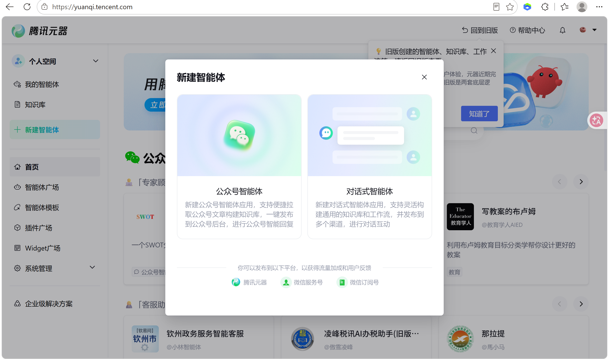
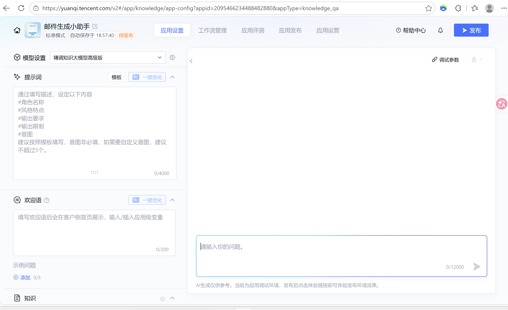
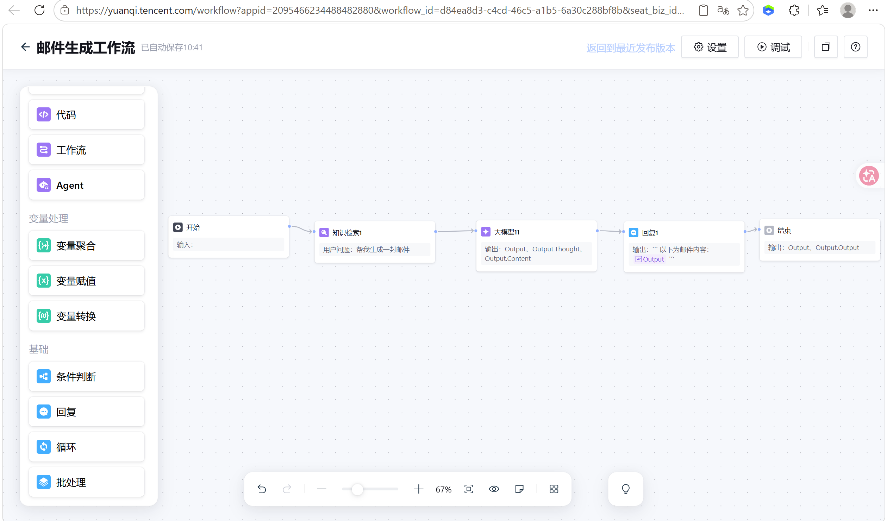
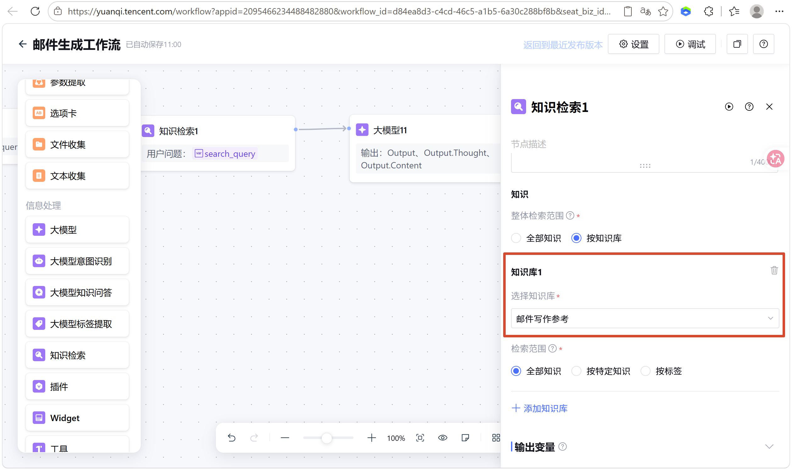
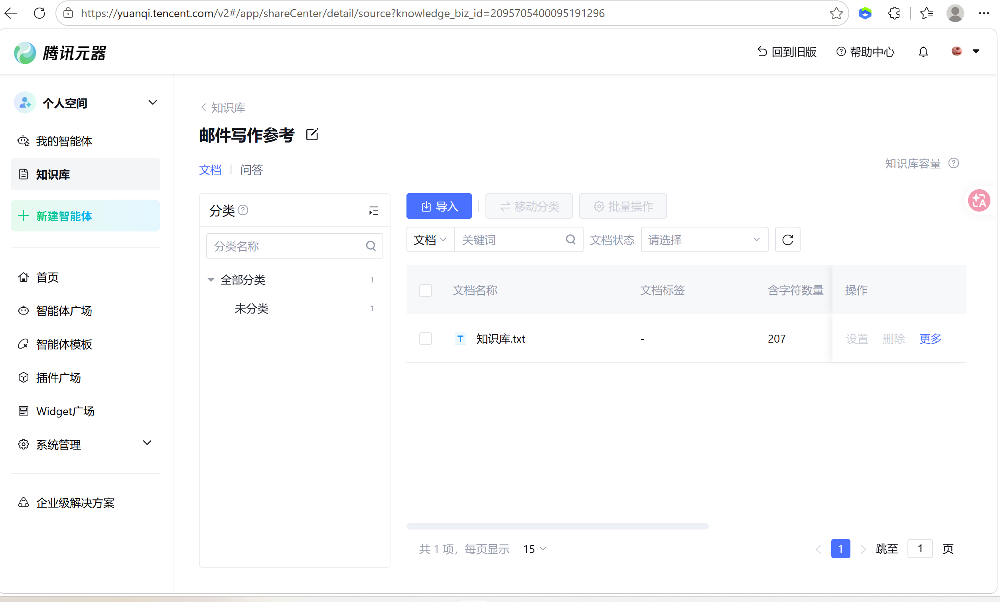
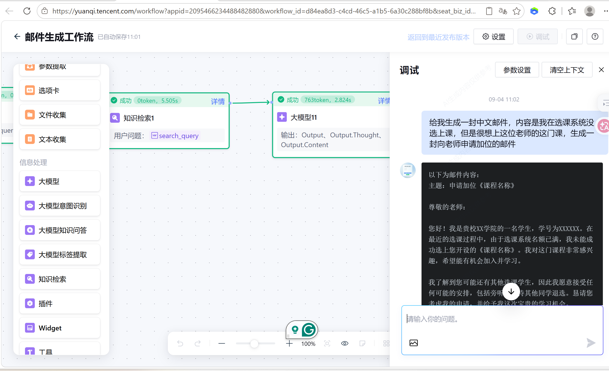
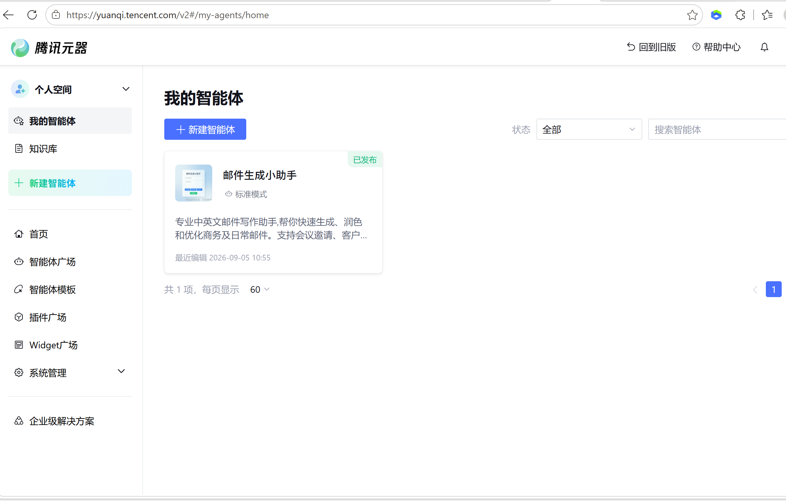
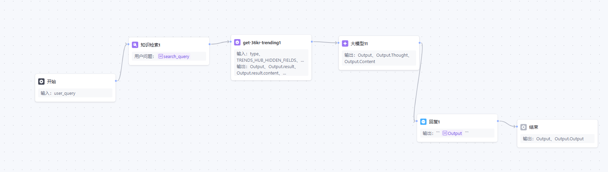

# 📧 腾讯元器邮件生成小助手

> AI Agent + RAG 实践：基于[腾讯元器](https://yuanqi.tencent.com/)平台搭建的**已发布**对话式智能体，帮助用户快速生成、润色和优化中英文商务及日常邮件。


## 这个智能体做什么

专业中英文邮件写作助手：支持会议邀请、客户跟进、求职致谢、请假咨询、对外商务沟通等场景，可调整正式或亲切语气，自动整理**邮件主题、称呼、正文与落款**的完整结构。

给它一句口语化的需求，例如：

> 给我生成一封中文邮件，内容是我在选课系统没选上课，但是很想上这位老师的这门课，生成一封向老师申请加位的邮件

它会输出一封结构完整、语气得体的正式邮件（主题 / 称呼 / 正文 / 结尾敬语 / 署名 / 日期）。

## 架构设计

智能体的核心是一条**节点式工作流**，把「意图识别 → RAG 知识检索 → 大模型生成」串成完整链路：

```
用户输入（user_query）
      │
      ▼
┌──────────┐    检索 query    ┌──────────────┐   参考资料   ┌──────────┐
│  开始节点  │ ──────────────▶ │ 知识检索（RAG） │ ─────────▶ │  大模型节点 │
└──────────┘                  └──────┬───────┘             └────┬─────┘
                                     │                          │ 生成的邮件
                              「邮件写作参考」                ▼
                              外部知识库 (.txt)        ┌──────────┐
                                                      │  回复节点  │ → 结束
                                                      └──────────┘
```

### 三大组成部分

| 组成 | 实现 | 说明 |
|------|------|------|
| **意图与提示词配置** | 元器应用设置 | 按「角色名称 / 风格特点 / 输出要求 / 输出限制 / 意图」框架编写提示词，配置场景描述与常见问法，模型使用混元知识大模型 |
| **工作流编排** | 元器工作流管理 | 开始 → 知识检索 → 大模型 → 回复 → 结束，节点间通过变量引用传递 `search_query` 与输出内容 |
| **RAG 知识库** | 知识库「邮件写作参考」 | 将邮件格式规范（结构、敬语、场景分类、中英文格式差异）存入外部 txt 文档，无需重新训练模型即可约束输出格式 |

知识库源文件：[`knowledge/email-writing-reference.txt`](knowledge/email-writing-reference.txt)

## 关键截图

**创建对话式智能体**



**应用配置：模型 + 提示词框架（角色/风格/输出要求/输出限制/意图）**



**工作流全链路（最终版：知识检索 → 大模型 → 回复）**



**知识检索节点：绑定「邮件写作参考」知识库**



**知识库「邮件写作参考」**



**工作流调试运行成功（真实测试用例）**



**调试完成后成功发布**



## 一些调试时绕的弯子（（

搭建过程中遇到的三个真实问题与解决过程：

1. **插件返回数据量过大导致模型报错**
   初版工作流接入了一个热点资讯插件（36kr trending），节点本身可跑通，但插件返回的 JSON 数据量远超邮件场景所需，拼入提示词后大模型报错。
   → **解决**：评估插件输出与业务场景的适配性，最终版工作流移除无关插件，保留「知识检索 → 大模型」的最短链路。

   初版含插件的工作流（对比用）：

   

2. **知识检索节点的知识库下拉框无法选中**
   → **解决**：排查后发现是节点连线与变量引用配置问题，调整连线与 `search_query` 变量的引用关系后恢复正常。

3. **输出结构不完整**
   大模型偶尔漏掉落款或主题。
   → **改进方向**：在提示词的「输出要求」中强制列出主题、称呼、正文、落款四要素（见下方复盘）。

## 复盘与可优化方向

- **知识库优化**：扩充真实邮件范文，对文档分块并调整切片大小，提高检索召回率；
- **插件替换**：把无关的热点插件换成翻译插件，贴合中英邮件互译的业务需求；
- **工作流容错**：增加判断节点，知识检索未命中时给大模型兜底的邮件格式提示；
- **输出校验**：要求大模型必须输出主题、称呼、落款，防止输出残缺邮件。

## 我的收获

- 理解了 **RAG 检索增强生成** 的作用：把自定义外部资料交给大模型，不需要重新训练模型就可以让 AI 遵守给定的格式规范；
- 体会到**节点式工作流**可以把检索、大模型、插件能力像搭积木一样串联，实现定制化 AI 应用；
- 认识到**插件能力需要与业务场景适配**，否则会造成系统运行异常——"能跑通"和"适合业务"是两回事。

---

*本项目为《人工智能与机器学习》课程实验一作品，在腾讯元器平台上搭建并已发布。*
